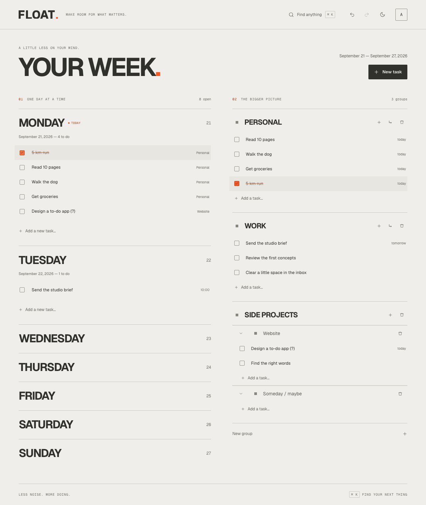
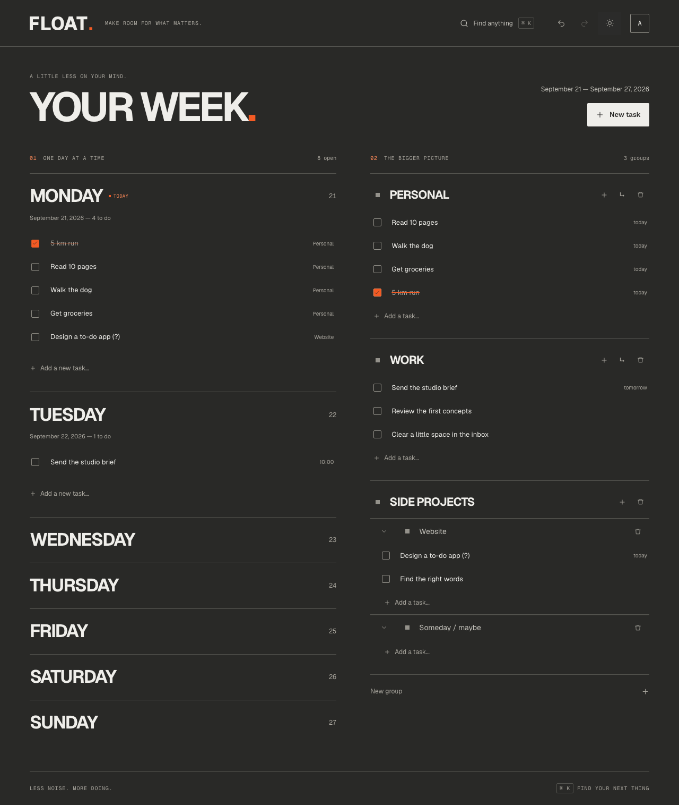
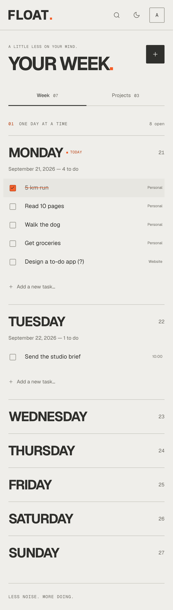
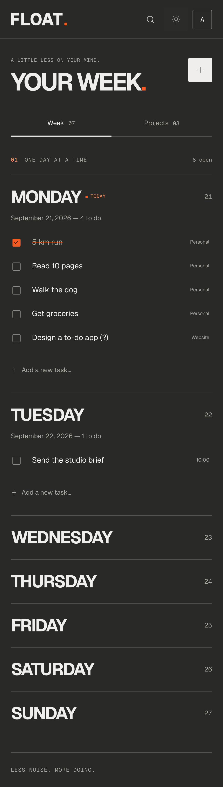

# Vérification de la refonte Daybook

26 septembre 2026. Aucun changement de backend, schéma ou déploiement.

## Résultats

| Contrôle | Résultat |
| --- | --- |
| `npm run check` | ESLint, 19 tests unitaires, Vite et TypeScript réussis |
| Playwright local, fixtures isolées | 22 scénarios réussis, Chromium desktop et mobile |
| Smoke de la nouvelle UI locale avec l’API réelle | 4 scénarios non destructifs réussis |
| Smoke sur `https://float.remenby.fr` | 4 scénarios non destructifs réussis |
| Assets | SVG, PNG, tokens JSON et archive téléchargeables |
| Contraste | Texte ≥4.5:1 sur les trois surfaces; bordures de cases ≥3:1 sur le fond |
| Responsive | 320, 390, 768, 1024 et 1440px, sans débordement du workspace |

Le smoke réel couvre connexion, recherche, suggestions, navigation du brouillon au
clavier, fermeture et affichage mobile. Il ne crée ni ne supprime de données.
Les modifications de tâches et de projets sont testées uniquement sur des fixtures
API locales. La production conserve son UI existante tant que la PR n’est pas livrée.

## Scénarios locaux

- Sept jours visibles, thèmes Paper et Graphite, couleur de barre système.
- Case 44×44px, validation orange, texte barré conservé pendant la session.
- Bascule Week / Projects et vérification des largeurs.
- Ajout depuis un jour avec sa date, soumission au clavier et par bouton tactile.
- Détail, renommage, notes, ouverture du calendrier, fermeture à un seul niveau.
- Palette de projet, premier groupe, confirmation annulable.
- Ajout en ligne sur 320px, undo et redo depuis le compte.
- Retour du focus, boucle de tabulation, respect de reduced motion.
- Tokens CSS concordants avec le JSON, assets, connexion et mot de passe affichable.
- Les huit tests préexistants de création et prévisualisation des dates.

## Captures relues

Ces images utilisent uniquement des données fictives; aucune donnée du compte réel.

| Paper | Graphite |
| --- | --- |
|  |  |
|  |  |

[Kit complet](previews/brand-kit.png) · [Détails](previews/task-details.png) · [Connexion mobile](previews/mobile-login.png)

## Reproduire

Depuis `frontend/`, lancer `npm run dev` puis, dans un autre terminal :

```sh
npm run check
npx playwright test tests/e2e/branding.spec.ts tests/e2e/command-palette.spec.ts --workers=3
```

Pour le smoke de production, charger `.secrets` sans afficher ses valeurs, puis
exécuter uniquement `tests/e2e/smoke.spec.ts` avec `FLOAT_E2E_BASE_URL` configuré.
Ne pas lancer de tests de mutation sur l’API réelle.

## Limites

Vérification automatisée dans Chromium desktop/mobile, pas sur un appareil iOS
physique. Les contrôles de contraste et de clavier ne remplacent pas un audit
d’accessibilité complet. L’installation PWA et les masques d’icônes ne sont pas
testés sur chaque OS. Aucun déploiement ni merge ne fait partie de cette livraison.
