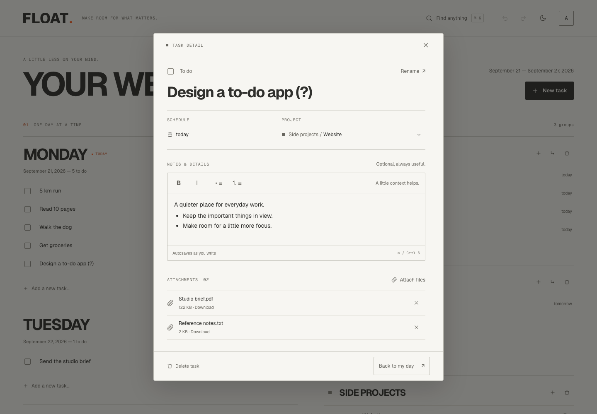
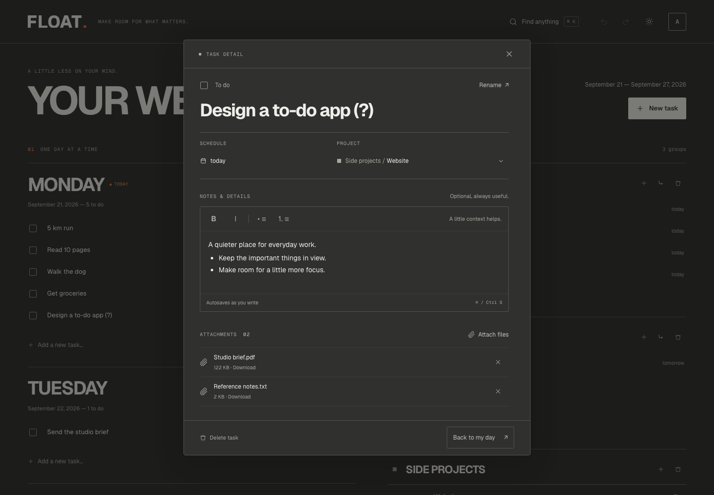

# Détail d’une tâche — Daybook

Cette amélioration fait suite à la refonte Daybook de la PR #5. Elle conserve la
palette Paper / Graphite, les filets fins et les contrôles carrés. Son périmètre
est la fiche d’une tâche, sans changement d’API ni de modèle de données.

## Critères de l’expérience

- Le titre reste lisible sur plusieurs lignes. Renommer est une action explicite;
  Entrée valide, Échap annule uniquement la modification en cours.
- Le statut, l’échéance et le projet sont immédiatement identifiables.
- Le changement de projet permet une recherche et respecte l’arborescence.
- L’éditeur expose ses outils sans imposer une sélection de texte préalable.
- Les notes indiquent l’état de sauvegarde. Une erreur laisse le brouillon intact
  et propose un réessai. Une réponse lente ne remplace pas un texte plus récent.
- Les pièces jointes affichent leur nom et leur taille, avec un ajout visible,
  un téléchargement et une suppression confirmée.
- Fermer une fiche, annuler une édition et fermer un sélecteur sont des actions
  distinctes. Les commandes restent utilisables au clavier et sur petit écran.
- La fiche s’adapte au contenu sur laptop et garde sa fermeture accessible dans
  la feuille mobile.

## Vérification

La suite `frontend/tests/e2e/task-detail.spec.ts` utilise uniquement des données
et une API simulées en local. Elle couvre les deux thèmes, les formats desktop et
mobile, les sauvegardes lentes ou en échec, les suppressions et les pièces jointes.

Les tests préexistants de branding et de recherche doivent continuer à passer.
Les checks de production se limitent au smoke non destructif; aucune tâche ou
pièce jointe réelle ne doit être créée, modifiée ou supprimée pour cette validation.

Les résultats finaux et les captures sont joints à la PR dédiée. Cette PR est
basée sur `feat/editorial-branding` tant que la PR #5 n’est pas fusionnée.

## Résultats — 26 septembre 2026

- `npm run check` : ESLint, 23 tests unitaires, Vite et TypeScript réussis.
- 48 tests Playwright locaux : 26 nouveaux scénarios de détail et 22 scénarios
  de régression, chacun sur Chromium desktop et mobile.
- 4 smoke tests non destructifs sur la production existante.
- 4 smoke tests non destructifs de la version compilée locale avec l’API réelle.
- Titres longs vérifiés à 320, 390, 768 et 1440px, sans débordement de la fiche.
- Aucune erreur JavaScript non interceptée dans les scénarios de détail.

Les notes inchangées ne sont pas sauvegardées à l’ouverture ou à la fermeture,
y compris si l’éditeur normalise la fin d’une liste. Une sauvegarde en retard ne
remplace pas un brouillon récent. L’échec de sauvegarde, de date, de renommage ou
de suppression de pièce jointe est explicitement testé. Le test clavier vérifie
également que Tab quitte un paragraphe pour rejoindre les actions de la fiche.

## Captures

Toutes les captures utilisent des données fictives. Les animations sont terminées
avant la capture; aucune donnée de production ne figure dans ces images.

[Mobile Paper](previews/mobile-paper.png) · [Mobile Graphite](previews/mobile-graphite.png) · [Avant](previews/before.png)

## Portée et limites

Les mutations restent dans TanStack Query; les états d’édition et la file des
actions restent locaux à la fiche. Pas de dépendance ajoutée, de migration, de
changement du backend ou de modification du reste du branding. Le CSS spécifique
est chargé avec la fonctionnalité et limité à la fiche.

Les tests sont exécutés dans Chromium, pas sur un iPhone physique. Une interruption
brutale du navigateur n’est pas un mécanisme de sauvegarde hors-ligne. La protection
de fermeture et le réessai concernent le brouillon présent dans la fiche. Aucun
déploiement ou merge n’est effectué dans cette livraison.
